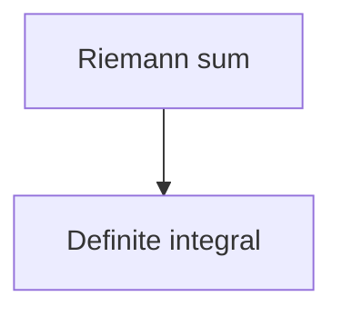

# Graph — the persisted knowledge layer

The teaching system builds a dependency graph in his head. This skill is how that graph is written down, so a later session can pick up where an earlier one stopped instead of re-probing from scratch.

Three artifacts. All three are written by you.

| File | Holds |
|---|---|
| `graphs/<subject>.md` | nodes and edges for one subject |
| `graphs/_bridges.md` | verified cross-domain connections |
| `graphs/.mastery.jsonl` | every graded quiz outcome |

## The ledger is the weak link — treat it accordingly

In the pi version of this system an extension captured quiz outcomes automatically, straight from the tool result, so the record could not drift from what actually happened. **Here there is no such hook. You write the ledger yourself, which is strictly weaker.**

Two rules follow, and they are not optional:

1. **Append the ledger line immediately after each quiz-check** — in the same turn, before teaching the next thing. Never batch entries at the end of a session. Batching is where entries get forgotten, and a forgotten entry is invisible: nothing downstream can tell "he was never tested" apart from "I forgot to write it down."
2. **Never invent an outcome.** Only write a line for a question he actually answered. If you are unsure whether something counted as a quiz-check, it didn't — leave it out.

The validator catches a malformed line or a node id that doesn't exist. **Nothing catches a line you never wrote.** That is the honest limit of this design.

## Why per-subject files and not one big graph

These graphs are **pedagogical, not ontological** — each one is a path to a goal, not a description of a field. One all-encompassing graph would have to load in full to answer anything and would accumulate nodes no lesson ever walks. Per-subject files keep every load bounded no matter how many subjects exist. Cross-domain connections live in exactly one place, `_bridges.md`, so they can never drift between two copies.

## Node identity — the join key

A node id is **stable kebab-case** (`riemann-sum`, `radical-214`). The same id appears in three places and must match exactly in all three:

1. The `id` field in the YAML `nodes` list.
2. The mermaid node id in the file body.
3. The `node` field on the ledger line recording a quiz about it.

That id is the only thing tying a quiz outcome to a position in the graph. **Once an id is published, never rename it** — renaming orphans every ledger entry pointing at it, silently erasing his history on that node. If a label is wrong, change the `label`; leave the `id` alone.

## Domain graph file

`graphs/<subject>.md` — YAML frontmatter plus a mermaid body.

````markdown
---
subject: calc2
title: Calculus II
updated: 2026-09-21
nodes:
  - id: riemann-sum
    label: Riemann sum
    kind: unconditional-truth
    deps: []
  - id: definite-integral
    label: Definite integral
    kind: derived
    deps: [riemann-sum]
---

# Calculus II


````

**Fields**

- `subject` — the filename stem. Lowercase, no spaces. This is what he types in review and synthesize.
- `title` — human-readable name.
- `updated` — ISO date of the last merge.
- `nodes[].id` — stable kebab-case, unique within the file.
- `nodes[].label` — short display text. Safe to change.
- `nodes[].kind` — `unconditional-truth` for roots he accepts at face value, `derived` for anything built on top. This mirrors Principle i in the teach skill: roots and derived facts are not the same thing, and the review ranking treats them differently.
- `nodes[].deps` — ids this node hangs off. Roots have `[]`.

**The body must agree with the frontmatter.** Every mermaid edge `a --> b` means `b` lists `a` in its `deps`, and every node id in the mermaid block is declared in `nodes`. The validator checks both directions.

**Mermaid gotcha:** a few bare words break the flowchart parser as node ids — `end`, `graph`, `o`, `x`. If a node would take one of those ids, prefix it (`end-behavior`, not `end`).

## Bridge index

`graphs/_bridges.md` — one YAML list, the single source of truth for every cross-domain connection.

````markdown
---
bridges:
  - from: calc2:definite-integral
    to: finance:present-value
    kind: formal
    claim: Present value of a continuous cash-flow stream is a definite integral of the discounted rate.
    status: verified
    evidence: [https://example.org/continuous-discounting]
    checked: 2026-09-21
---
````

**Fields**

- `from` / `to` — fully qualified `subject:node`. Both endpoints must exist in their domain graphs.
- `kind` — sets the evidence bar. See below.
- `claim` — one sentence stating the connection precisely enough to be wrong.
- `status` — `candidate`, `verified`, or `rejected`.
- `evidence` — source URLs. Required for `verified`.
- `checked` — ISO date of the last verification attempt.

### `kind` sets the evidence bar

This is the guard against teaching a connection that merely *sounds* right:

- **`formal`** — the same mathematical object literally appears in both domains. Lowest bar: the derivation itself is the evidence.
- **`structural`** — the mechanisms are genuinely isomorphic, not just superficially similar. Needs a source that states the correspondence, not one that merely discusses both topics.
- **`terminological`** / **`etymological`** — **highest bar. Requires a citation and is never accepted on reasoning alone.** A plausible-sounding character etymology or word origin is extremely easy to generate and extremely hard to spot as false. If the only support is that it sounds convincing, the status is `rejected`.

### Rejected bridges stay in the file

A candidate that fails verification is written back with `status: rejected` and its reason in `claim`. **Do not delete it.** Deleting it guarantees some future session re-proposes the same false connection and re-spends the research to kill it again.

## Mastery ledger

`graphs/.mastery.jsonl` — one JSON object per line, appended after every quiz-check.

```json
{"ts":"2026-09-21T14:02:11.482Z","subject":"calc2","node":"riemann-sum","correct":true,"dontKnow":false}
```

`note` is optional — include it when he says something revealing about his reasoning, right or wrong.

**Read rule: last entry wins.** A node's current state is its most recent line. Earlier lines are history — useful for seeing whether a node has been shaky repeatedly, which is a much stronger signal than one miss.

**A node with no line has never been tested.** That is not the same as a node he got wrong, and it is not the same as a node he knows. Treat it as unknown.

`dontKnow: true` means he declined to guess. That is a genuine gap to teach into, not a misconception to dislodge — the difference matters, so record it accurately rather than scoring it as wrong.

## Merging a new lesson map into an existing graph

At the end of a teach session you have a small lesson map. It merges into the domain file; it does **not** replace it.

1. Read the existing `graphs/<subject>.md`. If there is none, create it with the lesson map as its initial content.
2. For each node in the lesson map, match against existing nodes **by id**.
   - **New id** → append it to `nodes` and add its edges to the mermaid body.
   - **Existing id** → keep the id untouched. Update `label`, `kind`, or `deps` only if the lesson genuinely refined them.
3. Never drop a node that the lesson didn't happen to cover. The file is cumulative across every session on that subject.
4. Bump `updated`.
5. Re-check that body and frontmatter still agree.

**Rewriting the file wholesale is the one thing that must never happen** — it drops nodes from earlier sessions and orphans their ledger history. Use `Edit` to append, not `Write` to replace.

## Validating

Run the validator after any merge, and after writing ledger lines:

```bash
node .claude/skills/graph/validate.mjs graphs/
```

It asserts ids are unique, `deps` resolve, mermaid and frontmatter agree in both directions, bridge endpoints resolve to real `subject:node` pairs, `verified` bridges carry evidence, and ledger lines parse against real nodes. It needs no dependencies.

Test it against the shipped examples any time you want to confirm it still works:

```bash
node .claude/skills/graph/validate.mjs .claude/skills/graph/examples/
```
