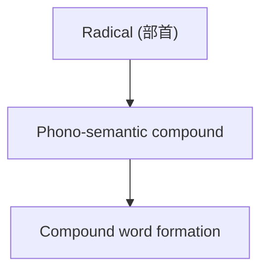

# Mandarin Chinese

```mermaid
graph TD
  radical["Radical (部首)"] --> phono-semantic-compound["Phono-semantic compound"]
  phono-semantic-compound --> compound-word-formation["Compound word formation"]
```
