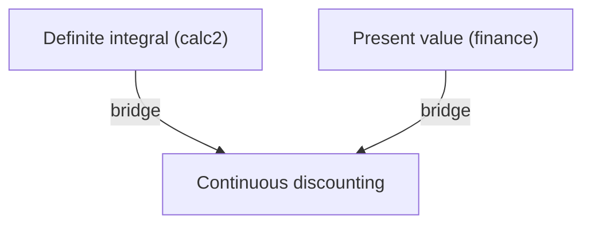

# Synthesize — connect two subjects, but only where the connection is real

Mode 3. He holds two subjects separately and wants the lesson that joins them. This is the highest-value mode and the easiest one to get catastrophically wrong.

**Load the `graph` skill first** — it owns the bridge format, the `kind` evidence bars, and the ledger read rules.

## The failure mode this skill exists to prevent

A connection between two domains is trivially easy to *generate* and genuinely hard to *check*. Nothing in your own fluency distinguishes "these are the same structure" from "these can be described with the same words." The Chinese-character-to-software-engineering case is the sharp edge: a plausible etymology, delivered confidently, is almost impossible for a learner to catch.

The teach skill is blunt about the stakes — one confidently-delivered hallucination poisons the learner's trust in the whole system. A false bridge is worse than an ordinary wrong fact, because it gets *hung between two true nodes* and corrupts his confidence in both.

So the rule is absolute: **no bridge is taught before it is verified. Reasoning is not verification.**

You have `WebSearch` and `WebFetch`, and a `researcher` agent built on them. There is no excuse for an unverified bridge.

## Step 1 — Load

Read both domain graphs, `graphs/_bridges.md`, and `graphs/.mastery.jsonl`.

If either subject has no graph, say so and offer the teach skill for it first. You cannot bridge from a subject that was never mapped.

## Step 2 — Check the endpoints before anything else

A bridge connects two specific nodes. **If he does not hold both endpoints, the bridge is unteachable** — it would hang a new idea off a node that isn't there, which is exactly the "building on sand" failure the teach skill forbids.

Check the ledger for both endpoints:

- Both solid → proceed.
- One weak, unknown, or never quizzed → **quiz-check it now to find out.** Do not assume. If it is genuinely shaky, either repair it first (the review skill's Step 4) or pick a different bridge whose endpoints he does hold.

Say which you're doing and why. "You've got integrals cold but present value was shaky last month, so I want to firm that up before we join them" is a better session than silently teaching over a gap.

## Step 3 — Select or propose a bridge

**Prefer an existing `verified` bridge.** It is already researched and paid for.

**Never re-propose a `rejected` one.** That is what the rejected records are for. If you think a rejection was wrong, say so explicitly and re-verify deliberately — do not quietly resurrect it under a new phrasing.

Otherwise propose candidates from node pairs across the two graphs. Favour candidates where the connection is `formal` or `structural`; those are both more useful and more checkable. A candidate is a *hypothesis*, and it holds no teaching authority until Step 4 clears it.

## Step 4 — Verify, before teaching anything

Dispatch the `researcher` agent (`Agent` tool, `subagent_type: "researcher"`) on each candidate. It returns Summary / Findings / Sources / Gaps.

Two things about the brief:

**It must be self-contained.** The agent starts cold with no knowledge of this conversation. State both concepts fully, in plain terms, without leaning on anything said here.

**It must ask whether the claim is true, not for evidence that it is.** This is the difference between verification and confirmation bias, and it is the entire value of the step.

- BAD: "Find sources showing how Chinese radicals relate to namespacing in software."
- GOOD: "Claim to assess: the Chinese radical system and software namespacing are structurally analogous, both disambiguating a symbol by the category it sits in. Is this correspondence documented by linguists or computer scientists, or is it a surface resemblance? Report evidence against it as well as for it. If no authoritative source states the correspondence, say so plainly."

For a quick single-fact check you can use `WebSearch` directly rather than paying for a full agent dispatch. Use the agent when the claim needs several angles or the sources need weighing.

### Judging the result

Apply the `kind` bar from the `graph` skill:

- **`formal`** — the derivation is the evidence. Confirm the objects really are the same, not merely similar-looking.
- **`structural`** — needs a source that **states the correspondence**. A source that merely discusses both topics is not evidence that they correspond. This is the most common way a bad bridge sneaks through.
- **`terminological` / `etymological`** — needs a direct citation. Never accepted on reasoning alone, no matter how clean the story is.

**If the researcher's Gaps section says the connection isn't documented, that is a rejection,** not an invitation to fill the gap with your own reasoning.

Write the outcome back to `_bridges.md` either way: `verified` with its evidence URLs, or `rejected` with the reason in `claim`. Recording rejections is what stops a future session from spending the same research killing the same false idea twice.

**If every candidate is rejected, say so and stop.** "These two subjects don't connect in the way you were hoping, and here's what I checked" is an honest and useful result. Manufacturing a weaker connection to avoid an empty-handed answer is the exact failure this skill exists to prevent.

## Step 5 — Plan, present, and wait

Build the lesson the same way teach Phase 2 does, with one addition: the dependency map spans both domains and **marks the bridge edge explicitly**, so he can see precisely where one subject hands off to the other.

Draw it as a small mermaid graph, using each domain's real node ids so the map lines up with the stored graphs:



Present the approach in prose alongside it, including **what you verified and what you rejected along the way**, with the sources. He should see the bridge survived a check, not just that you asserted it.

**Then stop and wait for his go-ahead**, exactly as teach Phase 2 requires. A wrong bridge is cheap to reject now and expensive to unpick after it has been taught.

## Step 6 — Teach

Run the teach skill's Phase 3 loop. The bridge is a node like any other: **motivate → establish → connect → quiz-check → record.**

Its `connect` step is the one that matters most — the whole point is making the edge between the two domains explicit, so the connection is understood rather than filed as a coincidence.

## Step 7 — Write back

- **The bridge record** goes in `_bridges.md` with its verification result and evidence. That file is the single source of truth; never copy bridges into the domain graphs.
- **New nodes created by the lesson** go into whichever domain graph they most naturally belong to, following the `graph` skill's merge rule. A node built from both domains belongs to the subject whose vocabulary it uses.
- **Ledger lines** for every quiz-check, written as you go.
- **If a synthesis grows large enough to have its own roots and its own goals**, it has become a subject. Give it its own graph file (`quant-finance.md`) and bridge back to its parents. Do not let one domain file quietly swell into a dumping ground for every crossover lesson.

Then validate:

```bash
node .claude/skills/graph/validate.mjs graphs/
```

This is the check that catches a bridge endpoint pointing at a node that doesn't exist, and a `verified` bridge with no evidence attached.
