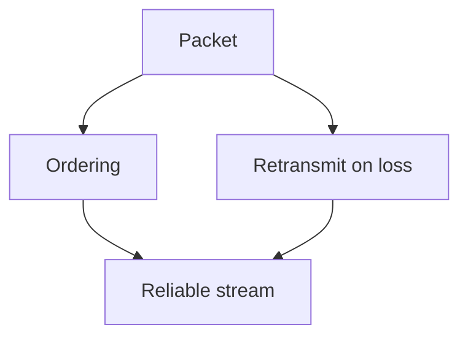

# Visualize

A picture earns its place only when it shows something words can't — shape, structure, direction, relationship. This skill produces ONE such picture and writes it into the lesson note as a ```mermaid``` block. Obsidian renders mermaid natively, so nothing needs generating, rendering, or embedding.

## When to visualize (and when not to)

This teaching system builds a **dependency graph in the learner's head** — unconditional truths at the roots, derived facts hanging off them. A visual is powerful exactly when it makes that structure visible. Reach for one when:

- The idea is a **structure or relationship**: dependencies, a system with parts and arrows, a flow/pipeline, a sequence of exchanges, a state machine, a tree/hierarchy, a comparison, a containment.
- You are presenting a **Phase 2 plan** — the dependency map is always worth drawing.

Do NOT visualize when prose or a single equation already carries it. A decorative diagram that just restates the sentence next to it adds noise and a chance to be wrong. **When in doubt, don't — a missing visual is cheaper than a false one.**

## The correctness problem — read this

The pi version of this system dispatched a subagent that rendered each diagram to an image, **looked at it**, and iterated until it was right. That loop does not exist here. Nothing checks your diagram before he reads it.

So the burden shifts entirely onto you, and two rules follow:

1. **Never assert anything in a diagram that isn't already established in the surrounding prose.** A diagram is a restatement of something you have already said carefully — not a place to introduce a new claim, and not a place to guess at a relationship you haven't verified. A wrong arrow is a wrong fact, and it's harder to spot than a wrong sentence.
2. **Re-read the source before you write it.** Walk each edge and ask: is this dependency actually true, in this direction? Mermaid will happily render something false and beautiful.

If you are unsure whether an edge is true, **omit it.** A sparse true diagram beats a complete uncertain one.

## One idea, fewest elements

The most common failure is **cramming** — every extra label makes the picture harder to read. Before writing, prune to the fewest elements that carry the idea, and for each ask: *"if I delete this, is the idea still clear?"* If yes, delete it.

- More than ~7 nodes means stop and simplify. Four nodes that each pull weight beat twelve that fight for space.
- Nodes hold a term or short phrase, never a sentence. Long labels wreck layout.
- Pick the diagram type that fits: `graph TD`/`LR` for dependencies and flows, `sequenceDiagram`, `stateDiagram-v2`, `mindmap`, `timeline`.
- `graph TD` with foundations at the top flowing down to conclusions matches the pedagogy directly, and is usually the right shape.

## Writing it

Put the block straight into the lesson note:

````markdown

````

Introduce it in a sentence, then let it carry the idea — don't narrate every element back in prose.

**Gotcha:** a few bare words break the flowchart parser as node ids — `end`, `graph`, `o`, `x`. Prefix them if needed (`end-state`, not `end`).

**When the diagram is a domain graph's dependency map, reuse that graph's real node ids** so the picture and the stored graph line up. The `graph` skill owns that format.

## Geometry is the gap

Spatial and geometric pictures — coordinate geometry, number lines, vectors, function plots, exact positions — are what mermaid can't express, and the SVG-authoring loop that handled them in the pi version has no equivalent here.

Options, in order of preference:

1. **Say it in prose and LaTeX.** Often enough; Obsidian renders LaTeX natively, and a clearly written equation beats a shaky drawing.
2. **Hand-author an SVG** into the note only if the geometry is simple and you can be certain every coordinate is right. You cannot see the result, so treat this as a last resort and keep it trivially simple.
3. **Say the picture would help and you can't reliably draw it.** Honest, and better than an incorrect figure.
